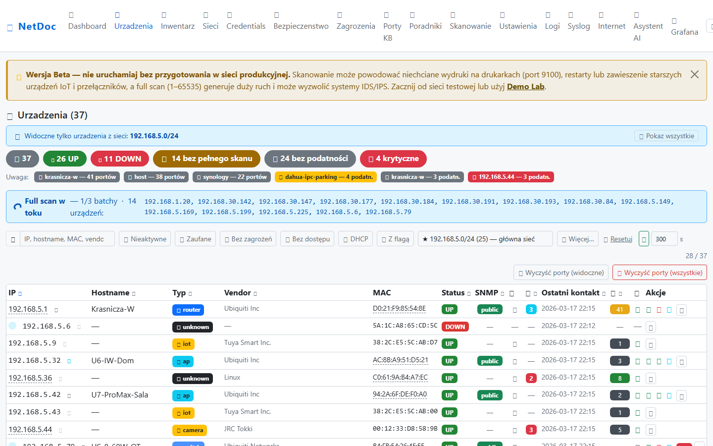
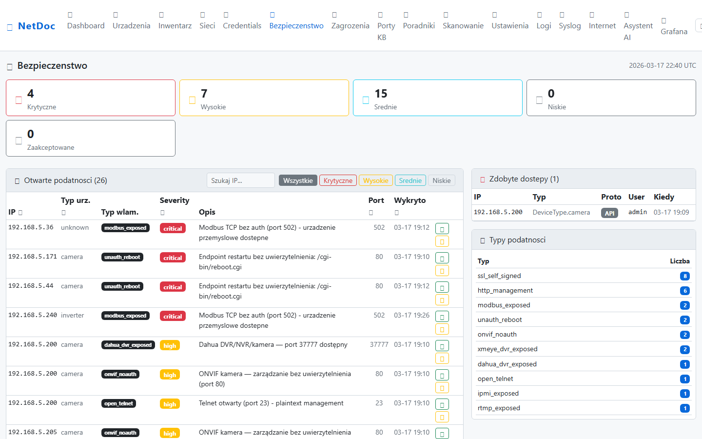
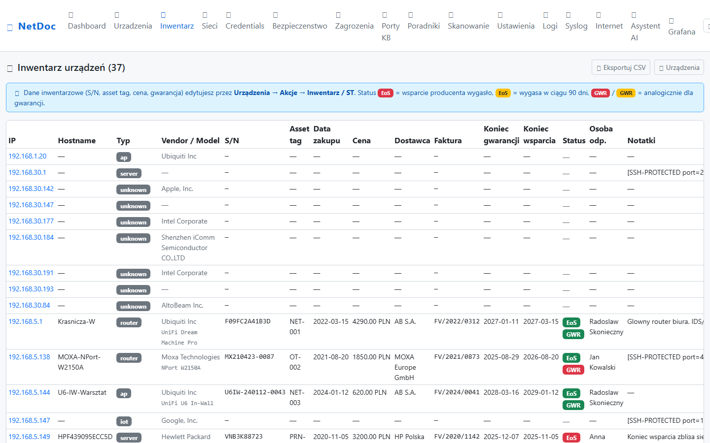
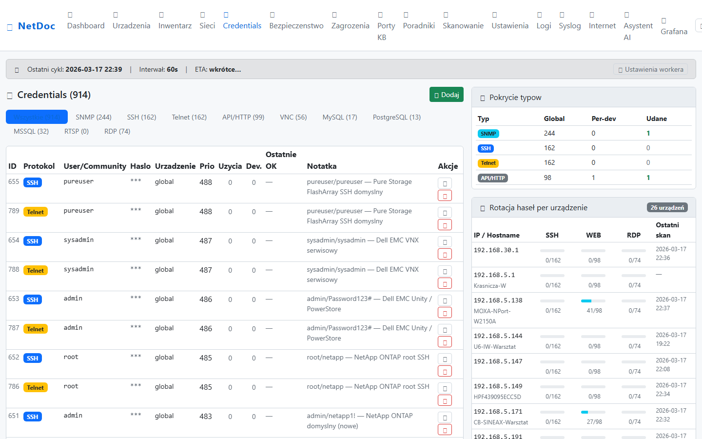
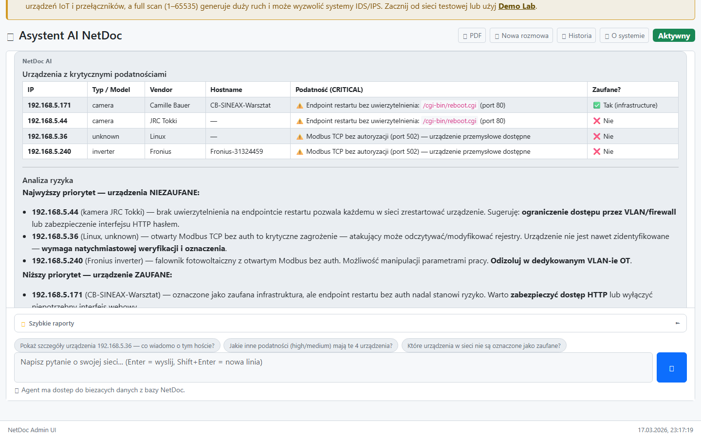
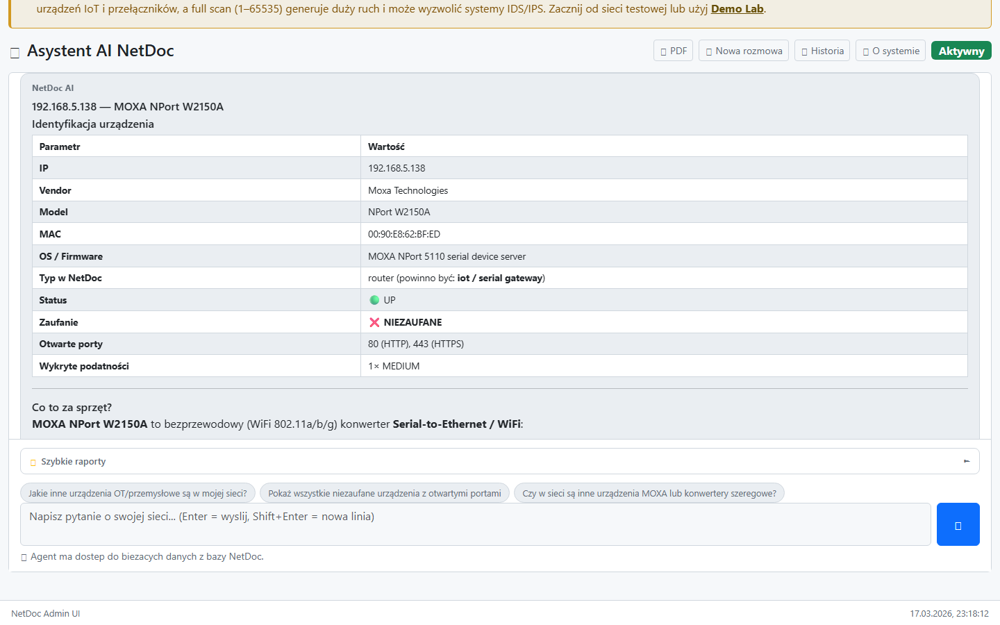
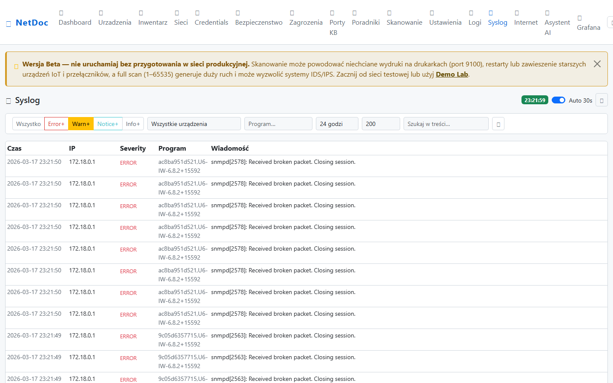
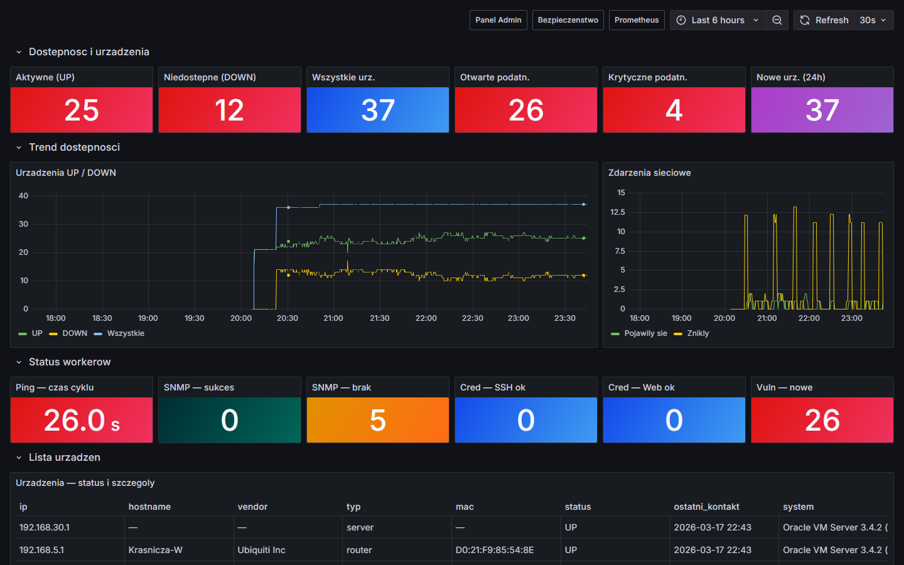

# NetDoc Collector

**Universal Network Discovery & Documentation System**

Automatyczne odkrywanie, dokumentowanie i monitorowanie infrastruktury sieciowej.
Niezalezny od producenta urzadzen — Cisco, MikroTik, Ubiquiti, Fortinet i inne.

🌐 **[netdoc.pl](https://netdoc.pl)** — strona projektu z demo, screenshotami i opisem funkcji

> **⚠️ Wersja Beta — przeczytaj przed uruchomieniem w sieci produkcyjnej**
>
> Skanowanie sieci moze powodowac niezamierzone skutki uboczne:
>
> - **Drukarki** mogą wykonac niechciany wydruk (skan portu 9100 / JetDirect)
> - **Starsze urzadzenia IoT i przelaczniki** moga zawiesic sie lub zrestartowac pod wplywem ruchu skanera
> - **Full port scan** (1–65535) generuje znaczny ruch i moze wyzwolic systemy IDS/IPS
>
> **Zalecane srodowisko startowe:** siec testowa, laboratorium lub dolaczone Demo Lab (`docker compose -f docker-compose.lab.yml up`).

---

## Screenshots

| Panel urządzeń | Bezpieczeństwo |
|---|---|
|  |  |

| Inwentarz (S/N, gwarancja, ceny) | Credentials — pokrycie sieci |
|---|---|
|  |  |

| AI Chat — analiza podatności | AI Chat — urządzenie MOXA (OT) |
|---|---|
|  |  |

| Syslog — logi sieciowe | Grafana — przegląd sieci |
|---|---|
|  |  |

---

## Architektura

```
Urządzenia sieciowe
  ├─ syslog UDP/TCP 514 → rsyslog → Vector → ClickHouse
  └─ nmap/ARP/SNMP ──→ Collector (host) → PostgreSQL → API (FastAPI)
                                                     ↓
                                              Flask Web Admin
                                                     ↑
                                   Docker workers (ping, snmp, cred, vuln,
                                                   community, internet)
```

| Warstwa | Technologie |
|---------|-------------|
| **Collector** | nmap, netmiko, pysnmp-lextudio, APScheduler |
| **Storage** | PostgreSQL (prod) / SQLite (dev), ClickHouse (syslog) |
| **API** | FastAPI + Uvicorn + Prometheus metrics |
| **Monitoring** | Grafana + Prometheus + Loki + Promtail |
| **Syslog pipeline** | rsyslog → Vector → ClickHouse |
| **Admin UI** | Flask web panel (port 5000) |

---

## Szybki start — Windows (zalecane)

Pobierz repozytorium i kliknij dwukrotnie:

```
netdoc-setup.bat
```

Instalator automatycznie:

- sprawdza i instaluje wymagania (WSL2, Docker Desktop, git, Python 3.11+)
- konfiguruje `.env` z szablonu
- uruchamia wszystkie kontenery Docker
- weryfikuje stan 16 kontenerow
- uruchamia pierwsze skanowanie sieci
- otwiera panel administracyjny w przegladarce

Wymagania: Windows 10 v2004+ (Build 19041), 8 GB RAM, ~10 GB wolnego miejsca.

> **Przed uruchomieniem Docker:** Docker Desktop → Settings → Advanced →
> wlacz *Allow the default Docker socket to be used* (wymagane przez web i promtail).

### Zatrzymanie / odinstalowanie

```
netdoc-uninstall.bat
```

Menu:

- **[1]** Zatrzymaj kontenery — dane zachowane
- **[2]** Pelne odinstalowanie — usuwa kontenery, voluminy, zadania Task Scheduler

---

## Szybki start — reczny (Linux / macOS / Windows bez instalatora)

**Wymagania:** Docker + Docker Compose v2 (`docker compose`, nie `docker-compose`), Python 3.10+, nmap w PATH.

```bash
# Linux/macOS
cp .env.example .env
# Edytuj .env jesli potrzeba (NETWORK_RANGES, CLICKHOUSE_PASSWORD itp.)

docker compose up -d
```

```
# Windows cmd
copy .env.example .env
docker compose up -d
```

> **Linux — port 514 (syslog):** Jezeli urzadzenia sieciowe wysylaja syslog do hosta,
> upewnij sie ze firewall przepuszcza port 514/UDP i 514/TCP z sieci lokalnej:
> `sudo ufw allow 514/udp && sudo ufw allow 514/tcp`

| Serwis | URL |
|--------|-----|
| NetDoc Admin (Flask) | http://localhost:5000 |
| NetDoc API (FastAPI) | http://localhost:8000 |
| Swagger UI | http://localhost:8000/docs |
| Grafana | http://localhost:3000 |
| Prometheus | http://localhost:9090 |
| Loki | http://localhost:3100 |
| ClickHouse HTTP | http://localhost:8123 |

Domyslne haslo Grafana: `admin / netdoc`

Skaner uruchamia sie na hoscie (pelny dostep do sieci, ARP table):

```bash
# Linux/macOS: upewnij sie ze nmap jest zainstalowany
# sudo apt install nmap   (Debian/Ubuntu)
# brew install nmap       (macOS)

pip install -r requirements.txt
python run_scanner.py --once
```

### Odbior syslogow z urządzeń sieciowych

Skonfiguruj urzadzenia sieciowe (routery, switche, AP) aby wysylaly syslog UDP na port 514
adresu IP hosta z NetDoc. Logi trafią automatycznie do ClickHouse i będą widoczne w zakładce
**Syslog** (NetDoc Pro) oraz na dashboardzie Grafana.

### Autostart (Windows Task Scheduler)

```powershell
powershell -ExecutionPolicy Bypass -File install_autostart.ps1
```

---

## Konfiguracja (.env)

```bash
cp .env.example .env
# Edytuj .env — zakres sieci, Telegram, SNMP community
```

Kluczowe zmienne:

| Zmienna | Opis | Domyslna |
|---------|------|---------|
| `NETWORK_RANGES` | Zakresy CIDR do skanowania | auto-detect |
| `SCAN_INTERVAL_MINUTES` | Czestotliwosc skanowania | 5 |
| `LOG_LEVEL` | Poziom logow | INFO |
| `FLASK_SECRET_KEY` | Klucz sesji Flask | dev-only |
| `TELEGRAM_BOT_TOKEN` | Token bota Telegram do alertow | opcjonalne |
| `CLICKHOUSE_PASSWORD` | Haslo ClickHouse (syslog) | netdoc |

Gdy `NETWORK_RANGES` jest puste, system automatycznie wykrywa lokalne podsieci.

---

## Uruchomienie developerskie

```bash
# Instalacja
pip install -r requirements-dev.txt

# Baza (PostgreSQL w Dockerze)
docker compose up -d postgres

# API
uvicorn netdoc.api.main:app --reload --port 8000

# Flask Admin UI
flask --app netdoc.web.app run --port 5000

# Skaner (discovery + pipeline)
python run_scanner.py --once
```

---

## Testy

```bash
# Uruchom wszystkie testy
pytest

# Z raportem pokrycia
pytest --cov=netdoc --cov-report=html
```

Pokrycie kluczowych modulow:

- `models.py` — 100%
- `normalizer.py` — 100%
- `api/routes/devices.py` — 97%
- `network_detect.py` — 89%
- Ogolne — ~80%

Liczba testow: **2470+** (jednostkowe + integracyjne)

---

## Funkcje

### Discovery

- **ARP scan** — wykrywanie aktywnych hostow
- **nmap** — fingerprinting OS, skanowanie portow (fast + full 1-65535)
- **OUI lookup** — identyfikacja producenta po MAC (IEEE MA-L/MA-M/MA-S, 39k+ wpisow)
- **Reklasyfikacja** — automatyczne przypisywanie typu urzadzenia (router/switch/camera/nas/printer/workstation/iot/...)

### Kolekcja

- **SNMP** — hostname, opis, lokalizacja, tablice ARP/routing (v2c, autodiscovery community)
- **SSH/Netmiko** — Cisco IOS/NX-OS, MikroTik RouterOS
- **UniFi API** — sprzet Ubiquiti (UniFi OS)
- **Modbus TCP** — inwertery, PLC, liczniki energii

### Syslog

- **Archiwizacja** — logi sieciowe z routerow, switchy i AP w ClickHouse (rsyslog → Vector → ClickHouse)
- **Filtrowanie** — severity, urzadzenie, program, zakres czasu, wyszukiwanie w tresci
- **Dashboard Grafana** — timeline logow, top urzadzenia, top programy
- **Pipeline** — Debian rsyslog (UDP/TCP 514), kolejka dyskowa, auto-retry

### Bezpieczenstwo

- **Skanowanie podatnosci** — 33+ kontrole: domyslne hasla, Telnet/RTSP/Modbus bez auth, ONVIF kamery, DVRIP, Redis, MongoDB, Docker API
- **Testowanie credentials** — SSH, HTTP Basic, SNMP, VNC, FTP, RDP, MySQL, MSSQL, PostgreSQL — 170+ par
- **Re-weryfikacja** — credentials sprawdzane przy kazdym cyklu skanowania

### Monitorowanie

- **Ping worker** — ciagle monitorowanie is_active co 18s
- **Alerty Telegram** — urzadzenie zniklo/pojawilo sie/wykryto podatnosc
- **Prometheus metrics** — liczniki urzadzen, skanow, bledow
- **Loki** — agregacja logow ze wszystkich kontenerow
- **Grafana dashboardy (6)** — inwentarz, security, workers, internet, logi, syslog

### Admin UI (Flask)

- Dashboard z podsumowaniem stanu sieci
- Zakładka Syslog — przegladanie i filtrowanie logow sieciowych
- Zarzadzanie sieciami i credentials (CRUD)
- Wyzwalanie skanowania (standard / full port scan / aktualizacja OUI)
- Podglad logow, alertow, podatnosci
- Asystent AI (wersja Pro)

---

## Struktura projektu

```
netdoc/
├── api/              # FastAPI endpoints
│   └── routes/       # devices, topology, events, scan, credentials, vulnerabilities, syslog
├── collector/        # Discovery engine
│   ├── discovery.py  # ARP + nmap + OUI + reklasyfikacja
│   ├── pipeline.py   # SNMP/SSH/Modbus kolekcja
│   ├── normalizer.py # Normalizacja danych
│   └── drivers/      # snmp, cisco, mikrotik, unifi, modbus
├── storage/          # SQLAlchemy models + database + clickhouse.py
├── notifications/    # Telegram alerts
└── web/              # Flask Admin UI + chat_agent
clickhouse/
└── init/             # Inicjalizacja bazy netdoc_logs (Dictionary, tabela syslog)
config/
├── grafana/          # Provisioning: datasources, dashboards (6 dashboardow)
├── loki/             # Loki config
├── promtail/         # Log shipper
├── rsyslog/          # rsyslog.conf (syslog receiver)
├── vector/           # syslog.toml (pipeline rsyslog → ClickHouse)
├── clickhouse/       # users.xml (profil netdoc)
└── lab/              # Demo Lab: PLC, router, SSH, HMI
docker/
└── rsyslog/          # Dockerfile (Debian rsyslog)
run_scanner.py        # Glowny skaner (host)
run_ping.py           # Ping worker (Docker)
run_snmp_worker.py    # SNMP enrichment worker (Docker)
run_cred_worker.py    # Credential testing worker (Docker)
run_vuln_worker.py    # Vulnerability scanner (Docker)
run_community_worker.py  # SNMP community discovery (Docker)
run_internet.py       # Internet connectivity checks (Docker)
tests/                # 2470+ testow jednostkowych
```

---

## Status wdrozenia

| Komponent | Status |
|-----------|--------|
| Discovery (ARP + nmap) | ✅ Done |
| OUI lookup (IEEE MA-L/MA-M/MA-S) | ✅ Done |
| Full port scan (1-65535, wielowatkowy) | ✅ Done |
| SNMP kolekcja + autodiscovery | ✅ Done |
| SSH kolekcja (Cisco, MikroTik) | ✅ Done |
| Modbus TCP (PLC, inwertery) | ✅ Done |
| Skanowanie podatnosci (33+ typow) | ✅ Done |
| Testowanie credentials (10 protokolow) | ✅ Done |
| Ping monitoring (co 18s) | ✅ Done |
| Alerty Telegram | ✅ Done |
| Syslog pipeline (rsyslog → Vector → ClickHouse) | ✅ Done |
| FastAPI REST | ✅ Done |
| PostgreSQL storage | ✅ Done |
| Prometheus metrics | ✅ Done |
| Grafana dashboardy (6 szt.) | ✅ Done |
| Loki + Promtail | ✅ Done |
| Flask Admin UI + zakładka Syslog | ✅ Done |
| Docker Compose (16 kontenerow) | ✅ Done |
| Demo Lab (symulowane urzadzenia) | ✅ Done |
| Testy jednostkowe (2470+) | ✅ Done |
| Task Scheduler (Windows autostart) | ✅ Done |
| Watchdog (auto-restart kontenerow) | ✅ Done |
| Mapa topologii sieci | 🔄 W trakcie |
| SNMP Walk (ARP, routing, LLDP) | 🔄 W trakcie |
| Raporty PDF | 📋 Planned |
| NetFlow / sFlow analiza ruchu | 📋 Planned |
| NIS2 / DORA Compliance Pack | 📋 Planned |
| Integracja Zabbix | 📋 Planned |
| Alerty email (SMTP) | 📋 Planned |

---

## Kontakt

- **Strona:** [netdoc.pl](https://netdoc.pl)
- **Kontakt biznesowy:** [LinkedIn](https://www.linkedin.com/in/radoslawskonieczny/)
- **Pytania techniczne:** [GitHub Issues](https://github.com/NetPlusRS/netdoc/issues)
- **Dyskusje:** [GitHub Discussions](https://github.com/NetPlusRS/netdoc/discussions)
